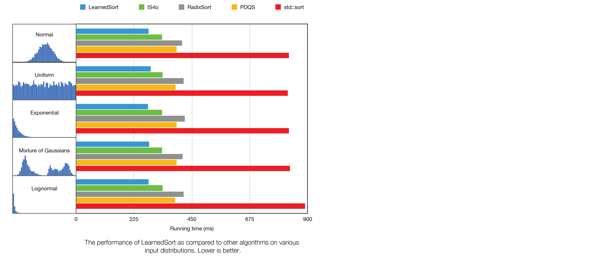
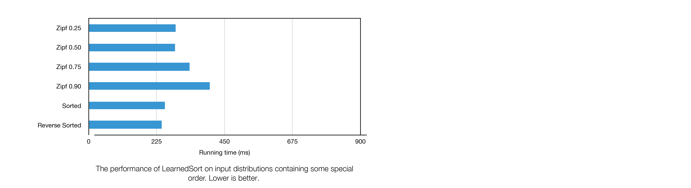

# Learned Sort

[](https://travis-ci.com/learnedsystems/learnedsort)
[](https://www.gnu.org/licenses/gpl-3.0)

The official repository for Learned Sort, a model-enhanced sorting algorithm that was published in [The Case for a Learned Sorting Algorithm](https://doi.org/10.1145/3318464.3389752).

Example:

```c++
#include "learned_sort.h"

int main(int argc, char *argv[]) {
  
    // Generate some data
    vector<double> arr = {...}

    // Sort in ascending order
    learned_sort::sort(arr.begin(), arr.end());
}
```

To get started, see [Build instructions](#building-this-project) and [Testing instructions](#running-the-unit-tests).

---

## Table of Contents

1. [Directory structure](#directory-structure)
1. [Instructions](#instructions)
    1. [Building this project](#building-this-project)
    1. [Running the benchmarks](#running-the-benchmarks)
    1. [Running the unit tests](#running-the-unit-tests)
1. [Usage](#usage)
    1. [Basic usage](#basic-usage)
    1. [More features](#more-features)
1. [Benchmark Results](#benchmark-results)
    1. [Benchmark setup](#benchmark-setup)
    1. [Performance charts](#performance-charts)
    1. [Special input types](#special-input-types)
1. [Limitations](#limitations)
1. [License & credits](#license--credits)

---

## Directory structure

This repository is organized as follows:

- The Learned Sort algorithm implementation in `include/learned_sort.h`
- Benchmarking code in `benchmarks_driver.cc`
- Unit testing code under `unit_tests/`
- Dependencies under `third_party/`

## Instructions

Learned Sort is distributed as part of a header-only library. Therefore, in order the use it, __it is enough to include the header file in your code__.  

```cpp
#include "learned_sort.h"
```

However, besides the Learned Sort implementation, this repository contains benchmarking and unit testing code. In order to execute those, follow the instructions below.

### Building this project

In order to build this project, you will need to have the following software installed in your system:

- [Git](https://git-scm.com/book/en/v2/Getting-Started-Installing-Git)
- [CMake](https://cmake.org/install/)
- Compiler with support for C++20

__NOTE__ This repository has only been tested on [GCC 9.3](https://gcc.gnu.org/releases.html) and [Clang 7.0.0](https://releases.llvm.org/7.0.0/tools/clang/docs/ReleaseNotes.html) on Linux Ubuntu Focal (20.04 LTS).

```sh
# Clone this repository
git clone --recursive https://github.com/learnedsystems/learned-sort.git

# Change into the code directory
cd learned-sort

# Run the compilation script
./compile.sh
```

The build directory should now look like this:

```text
/learned-sort
    /build
        /bin
            /LearnedSort_benchmarks
            /LearnedSort_tests
            /...
    /...
```

### Running the benchmarks

We use [Google Benchmark](https://www.github.com/google/benchmark) to measure the running times for Learned Sort and other sorting algorithm baselines for comparison.
The benchmarks will be run for various input size, and with enough iterations to provide a stable statistic.
The output will show the total running time (column "Time") and the time spent in the CPU (column "CPU") in milliseconds. 
Each row displays the name of the algorithm that is being benchmarked, followed by the input size and statistic type. 
The benchmark will repeat a few times (see `run.sh`) and it will report the mean, median, and standard deviation of the measurements.

In order to execute the benchmarks:

```sh
./run.sh
```

### Running the unit tests

We use [Google Test](https://www.github.com/google/googletest) and [GTest-Parallel](https://github.com/google/gtest-parallel/tree/df0b4e476f98516cea7d593e5dbb0fca44f6ee7f) to perform unit testing on Learned Sort and other baseline sorting algorithms on various data distributions and data types.
After downloading this repository, run the tests to make sure everything is working fine for your system setup.

In order to execute the unit tests:

```sh
./test.sh
```

Should any of the tests fail, then GTest will display a summary of the errors that occurred, otherwise no output is displayed.

## Usage

### Basic Usage

Generate or read some input data in a vector container and use `learned_sort::sort` as a drop-in replacement for `std::sort`.

```cpp
#include <iostream>
#include <random>
#include <vector>

#include "learned_sort.h"

int main(int argc, char *argv[])
{
    // Define some constants
    static constexpr size_t INPUT_SIZE = 1e6;
    static constexpr int MIN_KEY = 0;
    static constexpr int MAX_KEY = 1;

    // Generate some random uniformly distributed data
    std::random_device rd;
    std::mt19937 g(rd());
    std::uniform_real_distribution<> distribution(MIN_KEY, MAX_KEY);

    // Populate the input
    std::vector<double> arr;
    for (int i = 0; i < INPUT_SIZE; i++)
    {
        arr.push_back(distribution(g));
    }

    // Sort in ascending order
    learned_sort::sort(arr.begin(), arr.end());

    // Verify that the input is now sorted
    if(std::is_sorted(arr.begin(), arr.end()))
        std::cout << "Sorted!" << std::endl;
}
```

### Function signatures

The Learned Sort library provides the following functions:

```cpp

// Sort in ascending order
template <class RandomIt>
void learned_sort::sort(RandomIt begin, RandomIt end);

// Sort in ascending order using the specified RMI parameters
template <class RandomIt>
void learned_sort::sort(RandomIt begin, RandomIt end, learned_sort::RMI::Params &params);

// Train an RMI using the given RMI parameters
template <class RandomIt>
learned_sort::RMI learned_sort::train(RandomIt begin, RandomIt end, learned_sort::RMI::Params &p);
```

### Training and sorting parameters

In order to sort using a custom set of parameters, you can create an `RMI::Params` object as follows, and pass it to the sorting function:

```cpp
RMI::Params p; // Default parameters
```

or

```cpp
RMI::Params p(
    sampling_rate,      // float, [0-1],    default .01
    overallocation,     // float, >=1,      default 1.1
    fanout,             // unsigned int,    default 1000
    batch_size,         // unsigned int,    default 10
    threshold,          // unsigned int,    default 100
    model_architecture  // vector<unsigned int>, default {1, 1000} (Each number represents the number of linear models in the layer of the RMI)
    );
```

### Benchmarking on different data distributions

The default distribution of the input data for the benchmarks is set to a Normal distribution, however, we provide synthetic data generators for:

- Exponential distribution
- Lognormal distribution
- Normal distribution
- Uniform distribution
- Mixture of Gaussians distribution
- Chi Squared distribution
- Zipf distribution
- RootDups distribution (see: [BlockQuicksort paper](https://arxiv.org/pdf/1604.06697.pdf) p.15)

## Benchmark results

In the following sections we give concrete performance numbers for a particular server-grade computer.

### Benchmark setup

- __CPU__:  Intel&reg; Xeon&reg; Gold 6150 CPU @ 2.70GHz
- __RAM__:  376GB
- __OS__:   Linux Ubuntu 20.04, kernel 5.4.0-26-generic
- __CXX__:  GCC 9.3.0-10ubuntu2

### Performance charts
The following chart displays the performance of LearnedSort and other sorting algorithms on a set of randomly generated input distributions containing 10M keys. The histograms in the vertical axis correspond to the shape of the distributions used for the benchmark.

 

### Special input types
In the cases when the input distribution contain a large number of duplicates (e.g. Zipf distribution), or when the input is in some special order, the performance of LearnedSort changes as follows. (10M keys)

 


## Limitations

- This implementation of Learned Sort is only compatible with 2-layer RMI models as they have resulted in the most optimal performance.
- Currently it is not possible to sort records that contain payloads, i.e., the algorithm can only shuffle the keys in a sorted order. We are in the works of adding support for payloads.
- This implementation only supports numerical keys, while strings and other complex types are currently unsupported.
- This is the out-of-place variant of Learned Sort.

### Known bugs
Refer to the [Issues](https://github.com/learnedsystems/LearnedSort/issues?q=is%3Aissue+is%3Aopen+label%3Abug) page for known bugs.

## License & Credits

This work is licensed under the [GNU General Public License v3.0](LICENSE) and any use in academic settings must cite the corresponding paper:

```bibtex
@inproceedings{10.1145/3318464.3389752,
author = {Kristo, Ani and Vaidya, Kapil and \c{C}etintemel, Ugur and Misra, Sanchit and Kraska, Tim},
title = {The Case for a Learned Sorting Algorithm},
year = {2020},
isbn = {9781450367356},
publisher = {Association for Computing Machinery},
address = {New York, NY, USA},
url = {https://doi.org/10.1145/3318464.3389752},
doi = {10.1145/3318464.3389752},
booktitle = {Proceedings of the 2020 ACM SIGMOD International Conference on Management of Data},
pages = {1001–1016},
numpages = {16},
keywords = {linear models, linear interpolation, learned algorithm, RMI, sorting algorithm, ML for systems, CDF, sorting},
location = {Portland, OR, USA},
series = {SIGMOD '20}
}
  


```
