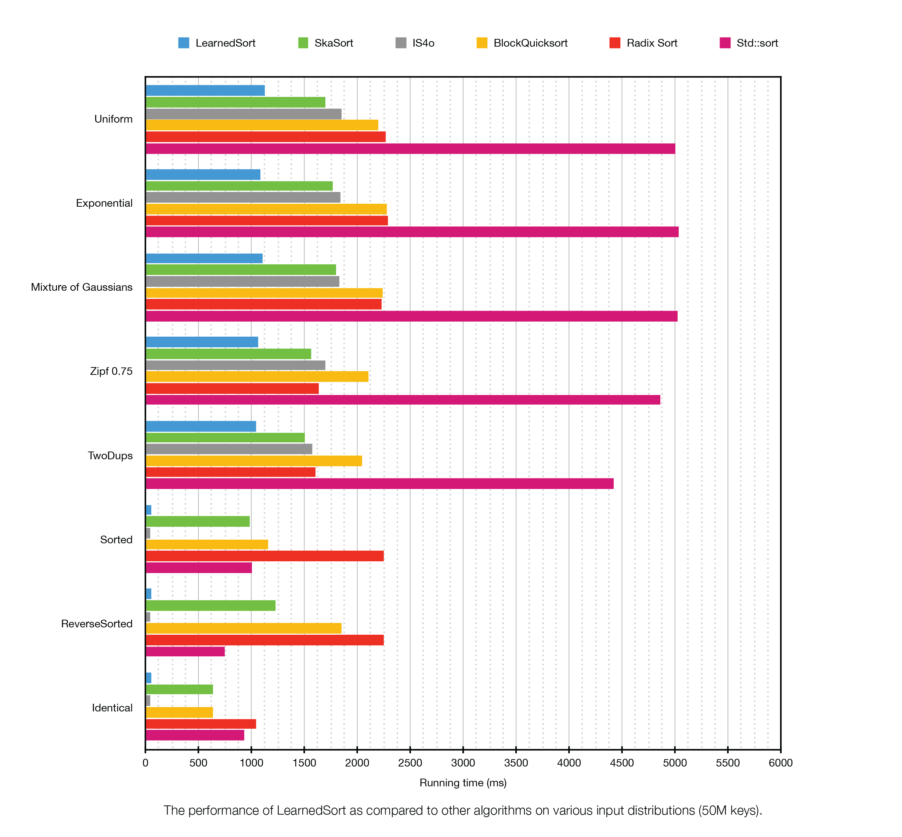

# LearnedSort
[](https://www.gnu.org/licenses/gpl-3.0)
[](https://travis-ci.com/learnedsystems/learnedsort)


The official repository for LearnedSort, a model-enhanced sorting algorithm. 

The repository contains the sources for LearnedSort as well as benchmarking code for both synthetic and real datasets.

Usage example:

```c++
#include "learned_sort.h"

int main(int argc, char *argv[]) {
  
    // Get some data
    vector<double> arr = {...}

    // Sort in ascending order
    learned_sort::sort(arr.begin(), arr.end());
}
```
<br>

# Building Instructions

## LearnedSort library
LearnedSort is distributed as part of a header-only library. 
Therefore, in order the use it, __it is enough to include the header file in your code__.  

```cpp
#include "learned_sort.h"
```

However, besides the LearnedSort implementation, this repository contains benchmarking and unit testing code. 
In order to execute those, follow the instructions below.

## Building the Benchmarks
The code in this repository has only been tested on Linux systems, including RHEL 7 and Ubuntu 20.04. 
In order to build the benchmarks, you will need the following dependencies:

- [Git](https://git-scm.com/book/en/v2/Getting-Started-Installing-Git)
- [CMake](https://cmake.org/install/)
- [GCC](https://gcc.gnu.org)
- [Python](https://www.python.org/downloads/)
- [NumPy](https://numpy.org/install/)
- [Matplotlib](https://matplotlib.org/stable/users/installing.html)

```sh
# Clone this repository
git clone --recursive https://github.com/learnedsystems/learned-sort.git

# Change into the code directory
cd learned-sort

# Run the compilation script
./compile.sh
```

## Running the unit tests
Before you run the benchmarks, we recommend that you run the unit tests first. 
We use [Google Test](https://www.github.com/google/googletest) to perform unit testing on LearnedSort and other baseline sorting algorithms on various data distributions and data types.
After downloading this repository, run the tests to make sure everything is working fine for your system setup. 
Should any of the tests fail, then GTest will display a summary of the errors that occurred, otherwise no output is displayed.

```sh
# Run all unit tests
./test.sh
```

## Running the synthetic benchmarks
We use [Google Benchmark](https://www.github.com/google/benchmark) to measure the running times for LearnedSort and other sorting algorithm baselines for comparison.
The benchmarks will be run for various input size, and with enough iterations to provide a stable statistic.
The output will show the total running time (column "Time") and the time spent in the CPU (column "CPU") in milliseconds. 
Each row displays the name of the algorithm that is being benchmarked, followed by the input size and statistic type. 
The benchmark will repeat a few times and it will report the mean, median, and standard deviation of the measurements. 
If you wish to change the number of repetitions (e.g., to 10), you can add the option `--benchmark_repetitions=<num_reps>` to the following command:

```sh
# Run the synthetic benchmarks
./synth_bench.sh
```

### Customizing the synthetic benchmarks
This script will use the default synthetic datasets, which is an array of 200M double-precision, normally-distributed keys. 
You may customize the benchmarks by editing the top of the file `src/main_synth.cc`:

```cpp
// NOTE: You may change the data type here
typedef double data_t;

// NOTE: You may change the distribution here
// For a list of supported distributions see src/utils.h
distr_t DATA_DISTR = NORMAL;

// NOTE: You may change the input size here
constexpr size_t INPUT_SZ = 100'000'000;
```


## Running the real benchmarks
For the real benchmarks, it is first required that the datasets from [Harvard Dataverse](https://dataverse.harvard.edu/dataverse/learnedsort) are fetched to this repository's tree, since they are not checked in Git. 
In order to do that, we provide a script that downloads the datasets, decompresses them, generates histograms of the data's distribution, and counts the number of unique keys in each dataset. 

After the datasets have been successfully retrieved, you may run the real benchmarks. 


```sh
# Download real datasets
./download_real_datasets.sh

# Run the real benchmarks
./real_bench.sh
```

### Customizing the real benchmarks
The script uses the NYC/Pickup dataset by default, however, just like the synthetic benchmarks, you may customize the real benchmarks by editing the top of the file `src/main_real.cc`. 

```cpp
// NOTE: You may change the data type here
typedef long data_t;

// NOTE: You may change the dataset here
// For a list of real datasets see the `data/` directory.
// Make sure to specify the correct data type for the selected dataset.
const string DATASET = "NYC/Pickup";
```

Below is a list of possible values for the `DATASET` variable grouped by the respective data types. 
For more information regarding the datasets, their properties, and what they represent, please check out our [Wiki](TODO ) TODO. 

__Decimal types (e.g. `double`)__: 
* `Chic/Tot`
* `NYC/Dist`
* `NYC/Tot`
* `Sof/Hum`
* `Sof/Press`
* `Sof/Temp`
* `Stks/Low`
* `Stks/Open`
* `Stks/Vol`


__Signed integer types (e.g. `long`)__: 
* `Chic/Start`
* `FB/IDs`
* `NYC/Pickup`
* `Stks/Date`
* `Wiki/Edit`

__Unigned integer types (e.g. `unsigned long`)__: 
* `Books/Sales`
* `OSM/Cell_IDs`


# Benchmark results
In the following sections we give concrete performance numbers for a particular server-grade computer. 

For a detailed list of benchmarks, refer to our papers:
* [The Case for a Learned Sorting Algorithm](https://dl.acm.org/doi/10.1145/3318464.3389752)
* [Defeating duplicates: A re-design of the LearnedSort algorithm](TODO)

## Benchmark setup
- __CPU__:  Intel&reg; Xeon&reg; Gold 6150 CPU @ 2.70GHz
- __RAM__:  376GB
- __OS__:   Linux Ubuntu 20.04, kernel 5.4.0-26-generic
- __CXX__:  GCC 9.3.0-10ubuntu2

## Performance charts
The following chart displays the performance of LearnedSort and other sorting algorithms on a set of randomly generated input distributions containing 50M keys. The histograms in the vertical axis correspond to the shape of the distributions used for the benchmark.

 

# Limitations
- Currently it is not possible to sort records that contain payloads. We are in the works of adding support for tuples.
- This implementation does not currently support string keys.

## Known bugs
Refer to the [Issues](https://github.com/learnedsystems/LearnedSort/issues?q=is%3Aissue+is%3Aopen+label%3Abug) page for known bugs.

# License & Credits
This work is licensed under the [GNU General Public License v3.0](LICENSE) and any use in academic settings must cite the corresponding paper:

```bibtex
@inproceedings{10.1145/3318464.3389752,
author = {Kristo, Ani and Vaidya, Kapil and \c{C}etintemel, Ugur and Misra, Sanchit and Kraska, Tim},
title = {The Case for a Learned Sorting Algorithm},
year = {2020},
isbn = {9781450367356},
publisher = {Association for Computing Machinery},
address = {New York, NY, USA},
url = {https://doi.org/10.1145/3318464.3389752},
doi = {10.1145/3318464.3389752},
booktitle = {Proceedings of the 2020 ACM SIGMOD International Conference on Management of Data},
pages = {1001–1016},
numpages = {16},
keywords = {linear models, linear interpolation, learned algorithm, RMI, sorting algorithm, ML for systems, CDF, sorting},
location = {Portland, OR, USA},
series = {SIGMOD '20}
}
```
